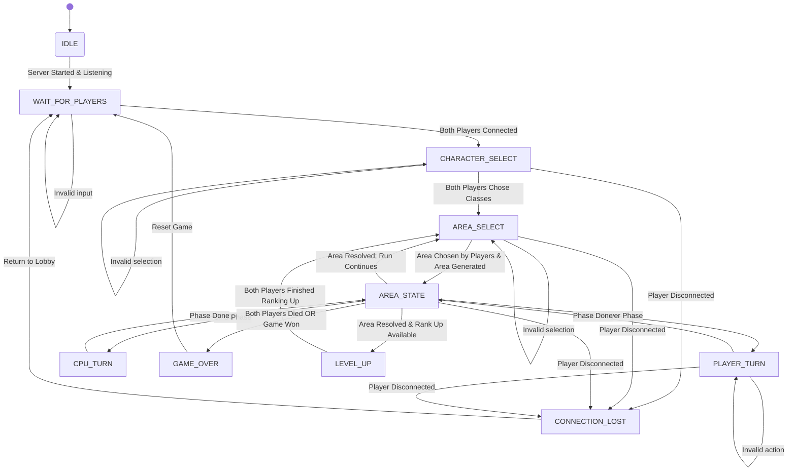

```mermaid
graph TD
    n1["Filled Circle"] --> n2["IDLE"]
    n2 -- Server Started & Listening --> n3["WAIT_FOR_PLAYERS"]
    n3 -- Both Players Connected --> n4["CHARACTER_SELECT"]
    n4 -- Both Players Chose Classes --> n5["AREA_SELECT"]
    n3 -- Invalid input --> n3
    n4 -- Invalid selection --> n4
    n5 -- Invalid selection --> n5
    n5 -- Area Chosen by Players & Area Generated --> n6["AREA_STATE"]
    n6 -- Player Phase --> n7["PLAYER_TURN"]
    n6 -- CPU Phase --> n8["CPU_TURN"]
    n8 -- Phase Done --> n6
    n7 -- Phase Done --> n6
    n7 -- Invalid action --> n7
    n4 -- Player Disconnected --> n10["CONNECTION_LOST"]
    n5 -- Player Disconnected --> n10
    n6 -- Player Disconnected --> n10
    n7 -- Player Disconnected --> n10
    n10 -- Return to Lobby --> n3
    n6 -- Both Players Died OR Game Won --> n9["GAME_OVER"]
    n9 -- Reset Game --> n3
    n6 -- Area Resolved; Run Continues --> n5
    n6 -- Area Resolved & Rank Up Available --> n13["LEVEL_UP"]
    n13 -- Both Players Finished Ranking Up --> n5

    n1@{ shape: f-circ}
    n2@{ shape: rounded}
```